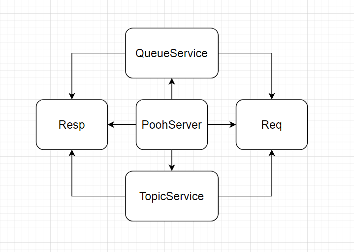

## Pooh JMS
### Описание
* Реализован аналог асинхронной очереди.
* Клиенты могут быть двух типов: отправители (publisher), получатели (subscriber).
* В качестве клиента используется cURL. Протокол HTTP.
* **_Режимы работы сервиса:_**
  * **_Queue_**:
  * Отправитель посылает запрос на добавление данных с указанием очереди (weather) и значением параметра (temperature=18).
  * Сообщение помещается в конец очереди. Если очереди нет в сервисе, то нужно создать новую и поместить в нее сообщение.
  * Получатель посылает запрос на получение данных с указанием очереди. Сообщение забирается из начала очереди и удаляется.
  * Если в очередь приходят несколько получателей, то они поочередно получают сообщения из очереди.
  * Каждое сообщение в очереди может быть получено только одним получателем.
  * Примеры запросов:
    * POST запрос должен добавить элементы в очередь weather.
    * curl -X POST -d "temperature=18" http://localhost:9000/queue/weather
    * queue указывает на режим «очередь». weather указывает на имя очереди.
    * GET запрос должен получить элементы из очереди weather.
    * curl -X GET http://localhost:9000/queue/weather. Ответ: temperature=18.
  * **_Topic_**:
  * Отправитель посылает запрос на добавление данных с указанием топика (weather) и значением параметра (temperature=18).
  * Сообщение помещается в конец каждой индивидуальной очереди получателей. Если топика нет в сервисе, то данные игнорируются.
  * Получатель посылает запрос на получение данных с указанием топика. Если топик отсутствует, то создается новый.
  * Если топик существует, то сообщение извлекается из начала индивидуальной очереди получателя и удаляется.
  * Когда получатель впервые получает данные из топика – для него создается индивидуальная пустая очередь.
  * Все последующие сообщения от отправителей с данными для этого топика помещаются в эту очередь тоже.
  * Таким образом в режиме "topic" для каждого потребителя своя будет уникальная очередь с данными, в отличие от режима "queue", где для все потребители получают данные из одной и той же очереди.
  * Примеры запросов:
    * POST /topic/weather -d "temperature=18", topic указывает на режим «topic»; weather указывает на имя топика.
    * GET /topic/weather/1, 1 - ID получателя; Ответ: temperature=18.
* **_Архитектура проекта:_**



### Инструменты
* Java 17
* Concurrency
* Socket
* IO
* JUnit 5
* Maven
* IDEA
* Git
### Запуск через терминал

<p>1. Собрать jar через Maven</p>

```bash
mvn package
```
<p>2. Запустить jar файл</p>

```bash
java -jar target/job4j_pooh-1.0-SNAPSHOT.jar
```

### Запуск через IDE

1. Перейти к папке ``src/main/java`` и файлу ``ru.job4j/pooh/service/PoohServer.java``
2. Нажать на кнопку запуска метода ``main`` в IDE
